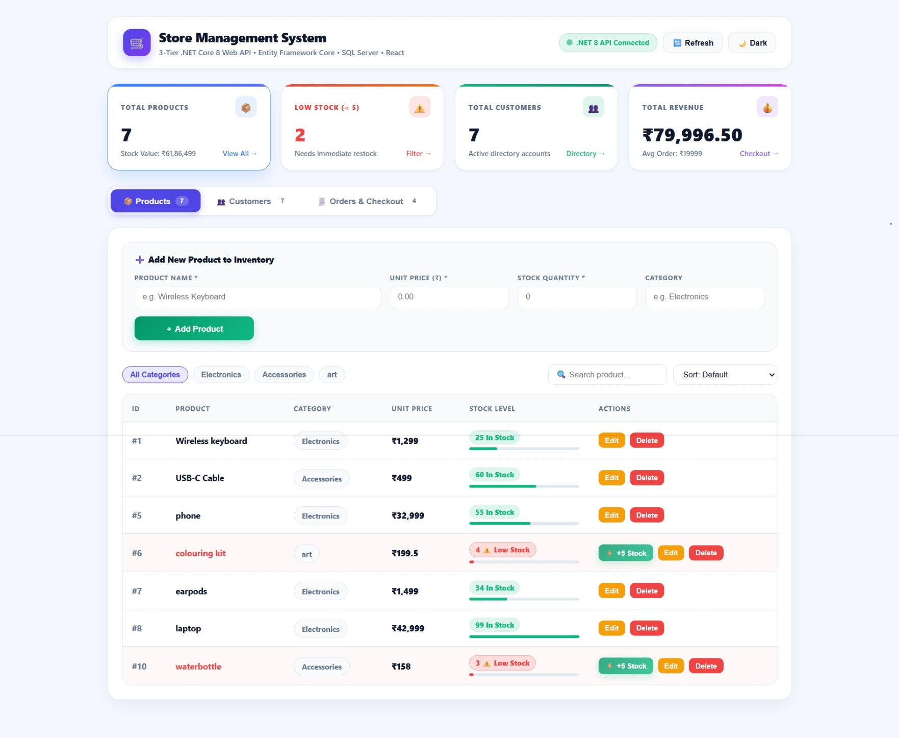
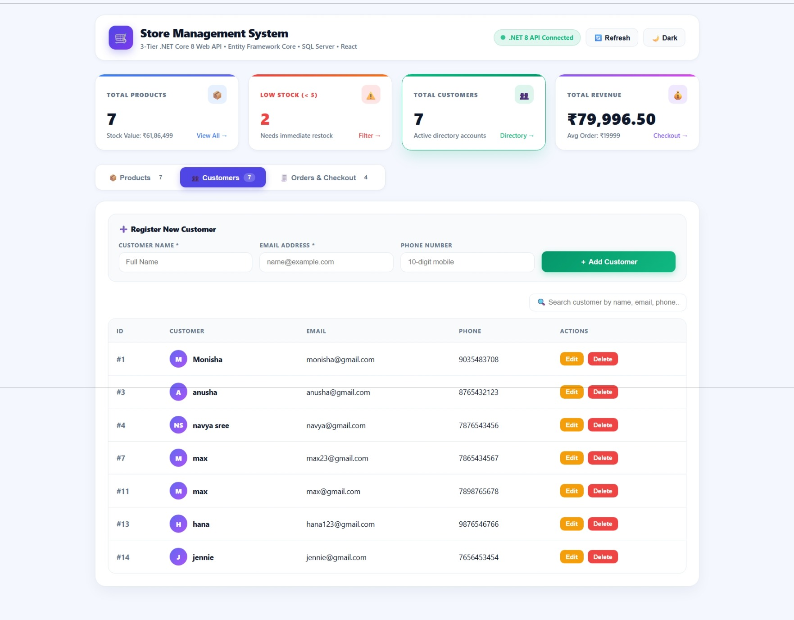
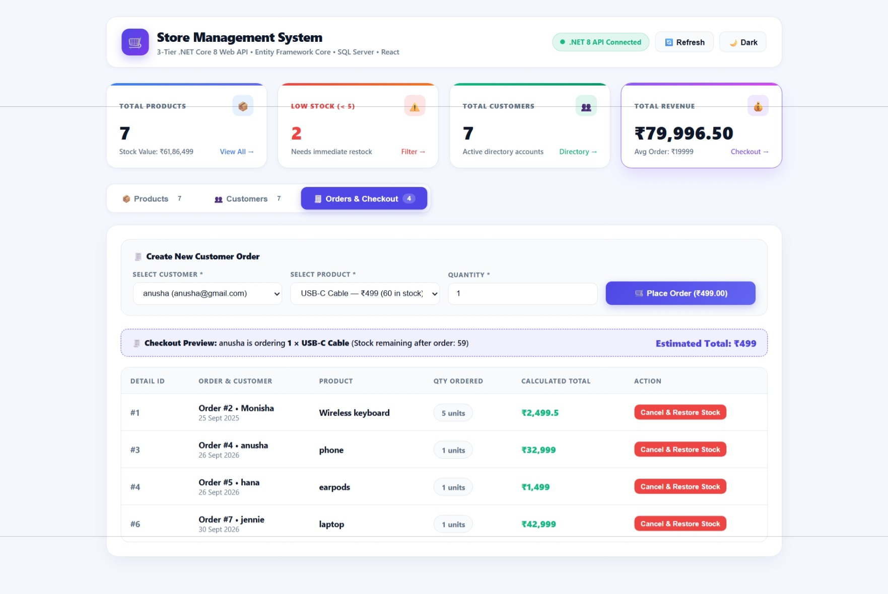
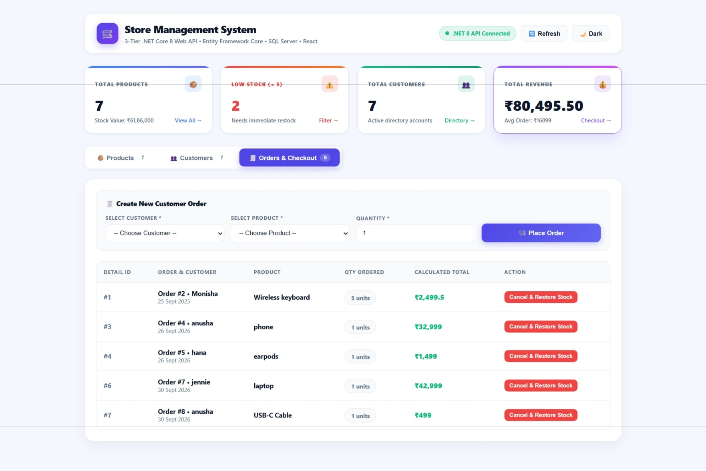
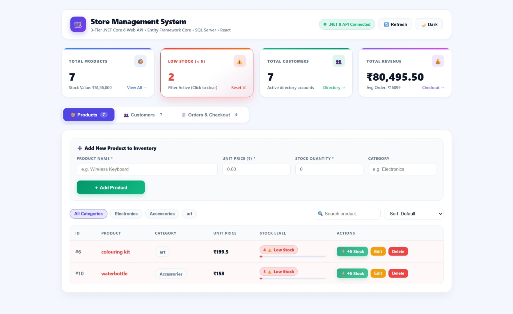
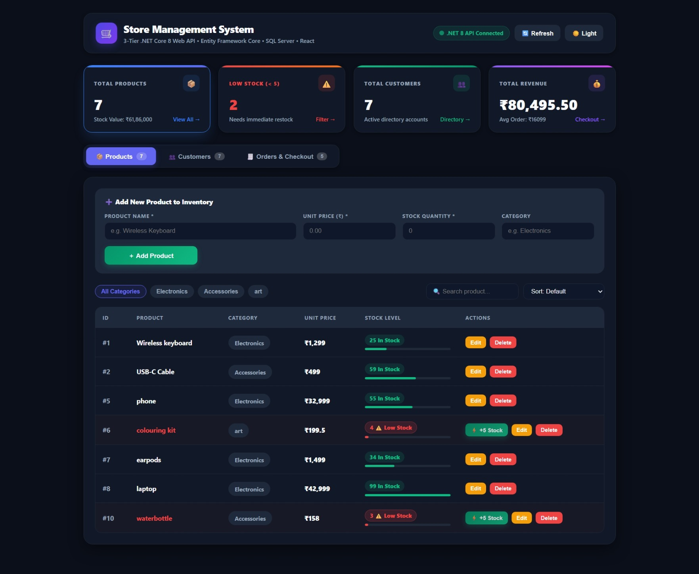
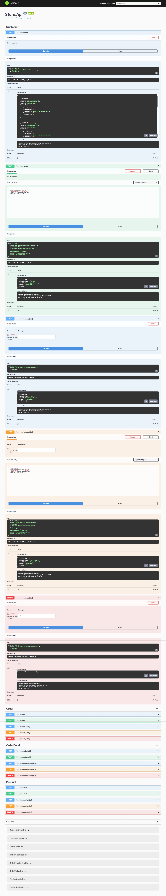

# 🛒 Store Management System

A full-stack **Store Management System** built using **ASP.NET Core 8 Web API, Entity Framework Core, SQL Server, and React**.

The application provides a structured solution for managing **products, customers, orders, inventory, and stock levels** through a modern web interface backed by a layered .NET architecture.

---

## 📌 Project Overview

The Store Management System is designed to simulate the core operations of a retail store.

It allows users to:

* Manage products and inventory
* Register and manage customers
* Create customer orders
* Automatically update stock when an order is placed
* Restore stock when an order item is cancelled
* Monitor low-stock products
* Search, filter, and sort products
* Search customers
* View inventory value and revenue metrics
* Switch between light and dark themes
* Interact with the backend through RESTful APIs

The project follows a **3-tier layered architecture** on the backend to maintain separation of concerns and improve maintainability.

---

# ✨ Key Features

## 📦 Product Management

* Add new products
* Update existing products
* Delete products
* View product inventory
* Categorize products
* Search products by name or category
* Filter products by category
* Sort products by:

  * Price — Low to High
  * Price — High to Low
  * Stock — Lowest First
  * Name — A to Z
* Identify low-stock products
* Quick restock functionality

### Low Stock Monitoring

Products with stock below **5 units** are highlighted as low-stock items.

A quick **+5 Stock** action is available directly from the inventory table.

---

## 👥 Customer Management

* Register new customers
* Update customer information
* Delete customers
* View customer directory
* Search customers by:

  * Name
  * Email
  * Phone number
* Customer initials are displayed using dynamic avatar generation

---

## 🧾 Order & Checkout Management

* Select a customer
* Select a product
* Enter order quantity
* Create a new order
* Display live checkout information
* Calculate the estimated order total
* Update inventory when an order is placed
* Cancel an order item
* Restore inventory when an order item is cancelled

The order workflow connects the **Orders**, **OrderDetails**, **Customers**, and **Products** entities.

---

## 📊 Dashboard & Analytics

The dashboard provides real-time operational metrics including:

* Total Products
* Total Customers
* Total Revenue
* Low Stock Count
* Inventory Value
* Average Order Value

The KPI cards are interactive and can navigate users directly to the corresponding management section.

---

## 🔎 Search, Filter & Sort

The frontend provides client-side interaction features including:

* Product search
* Category filtering
* Low-stock filtering
* Product sorting
* Customer search

This allows users to quickly locate the information they need without manually scanning the entire dataset.

---

## 🌙 Dark Mode

The application supports both:

* ☀️ Light Mode
* 🌙 Dark Mode

The theme is implemented using CSS custom properties and a `data-theme` attribute.

---

# 🏗️ System Architecture

The backend follows a **3-tier architecture**:

```text
                    ┌──────────────────────┐
                    │      React UI        │
                    │   StoreFrontend      │
                    └──────────┬───────────┘
                               │
                               │ HTTP / REST API
                               ▼
                    ┌──────────────────────┐
                    │     Store.Api        │
                    │    Controllers       │
                    └──────────┬───────────┘
                               │
                               ▼
                    ┌──────────────────────┐
                    │   Store.Services     │
                    │ Business Logic       │
                    │ Service Interfaces   │
                    └──────────┬───────────┘
                               │
                               ▼
                    ┌──────────────────────┐
                    │  Store.DataAccess    │
                    │ Repositories         │
                    │ EF Core / DbContext  │
                    └──────────┬───────────┘
                               │
                               │ Entity Framework Core
                               ▼
                    ┌──────────────────────┐
                    │     SQL Server       │
                    │  StoreManagement DB  │
                    └──────────────────────┘
```

### Request Flow

```text
React Frontend
      ↓
HTTP Request
      ↓
Controller
      ↓
Service Interface
      ↓
Service
      ↓
Repository Interface
      ↓
Repository
      ↓
DbContext
      ↓
SQL Server
      ↓
Response
      ↑
React Frontend
```

This separation keeps the API, business logic, and database operations independent from each other.

---

# 🧩 Backend Architecture

## 1. Store.Api

Responsible for handling HTTP requests and exposing RESTful API endpoints.

Contains:

* Controllers
* Program.cs
* Application configuration
* Dependency Injection configuration
* CORS configuration

Example controllers:

```text
ProductController
CustomerController
OrderController
OrderDetailController
```

---

## 2. Store.Services

Responsible for the application's business logic.

Contains:

```text
Interfaces
Services
```

The service layer communicates with repository interfaces rather than directly accessing the database.

Example:

```text
IProductService
ProductService

ICustomerService
CustomerService

IOrderService
OrderService

IOrderDetailService
OrderDetailService
```

---

## 3. Store.DataAccess

Responsible for database communication.

Contains:

```text
Models
Interfaces
Repositories
StoreManagementDbContext
```

Entity Framework Core is used to communicate with SQL Server.

Example repositories:

```text
IProductRepository
ProductRepository

ICustomerRepository
CustomerRepository

IOrderRepository
OrderRepository

IOrderDetailRepository
OrderDetailRepository
```

---

# 🗄️ Database Design

Database:

```text
StoreManagement
```

The system contains four primary tables:

### Customer

```text
CustomerId
CustomerName
Email
Phone
```

### Products

```text
ProductId
ProductName
Price
Quantity
Category
```

### Orders

```text
OrderId
CustomerId
OrderDate
```

### OrderDetails

```text
OrderDetailId
OrderId
ProductId
Quantity
```

### Entity Relationships

```text
Customer
   │
   │ 1 : Many
   ▼
Orders
   │
   │ 1 : Many
   ▼
OrderDetails
   │
   │ Many : 1
   ▼
Products
```

The database script is included in the repository:

```text
DatabaseScript.sql
```

---

# 🔌 REST API

The backend exposes RESTful endpoints for the main entities.

| Method | Endpoint                | Purpose             |
| ------ | ----------------------- | ------------------- |
| GET    | `/api/Product`          | Get all products    |
| GET    | `/api/Product/{id}`     | Get product by ID   |
| POST   | `/api/Product`          | Add product         |
| PUT    | `/api/Product/{id}`     | Update product      |
| DELETE | `/api/Product/{id}`     | Delete product      |
| GET    | `/api/Customer`         | Get all customers   |
| GET    | `/api/Customer/{id}`    | Get customer by ID  |
| POST   | `/api/Customer`         | Add customer        |
| PUT    | `/api/Customer/{id}`    | Update customer     |
| DELETE | `/api/Customer/{id}`    | Delete customer     |
| GET    | `/api/Order`            | Get orders          |
| POST   | `/api/Order`            | Create order        |
| DELETE | `/api/Order/{id}`       | Delete order        |
| GET    | `/api/OrderDetail`      | Get order details   |
| POST   | `/api/OrderDetail`      | Create order detail |
| DELETE | `/api/OrderDetail/{id}` | Delete order detail |

> The exact endpoint behavior is implemented by the controllers and service/repository layers in the project.

---

# 🔄 Example Order Workflow

When a user places an order:

```text
1. User selects Customer
          ↓
2. User selects Product
          ↓
3. User enters Quantity
          ↓
4. React sends POST request
          ↓
5. Order is created
          ↓
6. OrderDetail is created
          ↓
7. Stock is updated
          ↓
8. Updated data is returned
          ↓
9. React refreshes the dashboard
```

When an order item is cancelled:

```text
Cancel Order Item
       ↓
Delete OrderDetail
       ↓
Restore Product Quantity
       ↓
Refresh Products / Orders
       ↓
Updated Inventory
```

---

# 🛠️ Technology Stack

## Backend

* **C#**
* **ASP.NET Core 8 Web API**
* **Entity Framework Core**
* **SQL Server**
* **LINQ**
* **Dependency Injection**
* **RESTful APIs**
* **Swagger / OpenAPI**

## Frontend

* **React**
* **JavaScript**
* **HTML5**
* **CSS3**
* **Axios**
* **Vite**

## Development Tools

* Visual Studio
* Visual Studio Code
* SQL Server / SQL Server Management Studio
* Git
* GitHub
* Swagger UI

---

# 📁 Project Structure

```text
Store.Api.sln
│
├── Store.Api
│   ├── Controllers
│   │   ├── CustomerController.cs
│   │   ├── ProductController.cs
│   │   ├── OrderController.cs
│   │   └── OrderDetailController.cs
│   │
│   ├── Program.cs
│   └── appsettings.json
│
├── Store.DataAccess
│   ├── Models
│   │   ├── Customer.cs
│   │   ├── Products.cs
│   │   ├── Orders.cs
│   │   └── OrderDetails.cs
│   │
│   ├── Interfaces
│   ├── Repositories
│   └── StoreManagementDbContext.cs
│
├── Store.Services
│   ├── Interfaces
│   └── Services
│
├── StoreFrontend
│   ├── public
│   ├── src
│   ├── package.json
│   ├── vite.config.js
│   └── index.html
│
├── screenshots
│   ├── products.jpeg
│   ├── customers.jpeg
│   ├── orders.jpeg
│   ├── low-stock.jpeg
│   ├── order-completed.jpeg
│   ├── dark-mode.jpeg
│   └── swagger.jpeg
│
├── DatabaseScript.sql
└── README.md
```

---

# 🖥️ Application Screenshots

## 📦 Product Management

Product inventory with product CRUD operations, category filtering, search, sorting and stock indicators.



---

## 👥 Customer Management

Customer directory with search, registration, update and delete functionality.



---

## 🧾 Orders & Checkout

Customer order creation with product selection, quantity management and live checkout preview.



---

## 📦 Order Completed

Successful order processing with inventory update and order confirmation.



---

## ⚠️ Low Stock Monitoring

Low-stock products are visually highlighted with a quick restock action.



---

## 🌙 Dark Mode

Responsive dark theme for improved usability.



---

## 🔌 Swagger API

REST API endpoints can be tested through Swagger UI.



---

# ⚙️ Setup & Installation

## Prerequisites

Make sure the following are installed:

* .NET 8 SDK
* SQL Server
* SQL Server Management Studio
* Node.js
* npm
* Visual Studio
* Visual Studio Code

---

## 1. Clone the Repository

```bash
git clone <YOUR-GITHUB-REPOSITORY-URL>
```

Navigate into the project:

```bash
cd <PROJECT-FOLDER>
```

---

## 2. Configure SQL Server

Create the database using the provided:

```text
DatabaseScript.sql
```

Open the script in SQL Server Management Studio and execute it.

---

## 3. Configure Connection String

Open:

```text
Store.Api/appsettings.json
```

Update the SQL Server connection string according to your local SQL Server configuration.

Example:

```json
{
  "ConnectionStrings": {
    "StoreConnection": "Server=YOUR_SERVER;Database=StoreManagement;Trusted_Connection=True;TrustServerCertificate=True;"
  }
}
```

---

## 4. Run the Backend

Open the solution:

```text
Store.Api.sln
```

Run the ASP.NET Core Web API from Visual Studio.

Swagger should open automatically.

The API runs on the configured HTTPS port.

---

## 5. Run the React Frontend

Open a terminal inside:

```text
StoreFrontend
```

Install dependencies:

```bash
npm install
```

Start the development server:

```bash
npm run dev
```

Open the local URL displayed by Vite.

---

# 🔗 Frontend–Backend Integration

The React application communicates with the ASP.NET Core API using Axios.

The frontend API base URL is configured as:

```javascript
const API_BASE = "https://localhost:7172/api";
```

Example:

```javascript
const res = await axios.get(`${API_BASE}/Product`);
```

The backend enables CORS so that the React development server can communicate with the .NET API during local development.

---

# 💡 Key Implementation Concepts

This project demonstrates practical understanding of:

### Object-Oriented Programming

* Classes and objects
* Interfaces
* Encapsulation
* Abstraction
* Dependency Injection

### ASP.NET Core

* Web API controllers
* Routing
* HTTP methods
* Model binding
* Dependency Injection
* CORS
* REST API design
* Swagger

### Entity Framework Core

* DbContext
* Entity models
* LINQ
* CRUD operations
* Navigation properties
* Relationships
* `Include()`
* `SaveChanges()`

### Repository & Service Pattern

The application separates:

```text
Controller
    ↓
Service
    ↓
Repository
    ↓
DbContext
    ↓
Database
```

This helps keep responsibilities separated and makes the application easier to maintain and extend.

### React

* Functional components
* `useState`
* `useEffect`
* Event handling
* Conditional rendering
* Form handling
* API integration using Axios
* Client-side filtering and sorting
* Dynamic UI updates

---

# 🎯 Project Highlights

Some of the implementation details that make the application more than a basic CRUD project include:

* 3-tier backend architecture
* Repository and service abstraction
* Entity Framework Core integration
* SQL Server relational database
* React frontend integration
* REST API communication using Axios
* Real-time inventory metrics
* Low-stock detection
* One-click stock restocking
* Search, filter and sort functionality
* Live checkout preview
* Inventory update during order processing
* Inventory restoration during order cancellation
* Light/Dark theme support
* Swagger API documentation
* Responsive and modern dashboard interface

---

# 🚀 Future Enhancements

Possible future improvements include:

* Authentication and role-based authorization
* Admin and staff roles
* Pagination for large datasets
* Advanced sales analytics
* Multiple products per order
* Order status management
* Product image management
* Export reports to Excel/PDF
* Server-side search and filtering
* Centralized exception handling
* Logging and monitoring
* Deployment to a cloud environment

---

# 👩‍💻 Author

**Monisha P.**

B.E. Computer Science & Engineering

Built as a full-stack application to demonstrate practical skills in:

**C# • ASP.NET Core • Entity Framework Core • SQL Server • React • REST APIs • Git**

---

## ⭐ Project Summary

> A full-stack Store Management System combining a **layered ASP.NET Core 8 Web API**, **Entity Framework Core**, **SQL Server**, and a **React-based frontend** to provide product, customer, inventory, and order management through a modern and interactive user interface.
